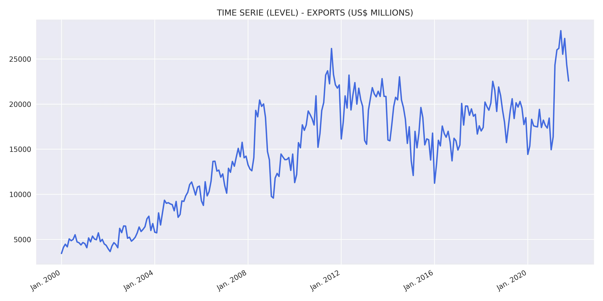
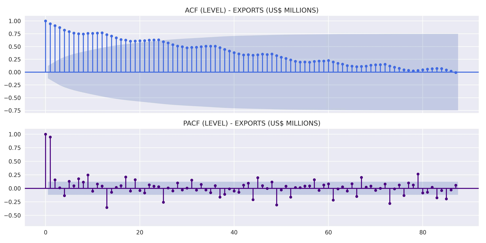
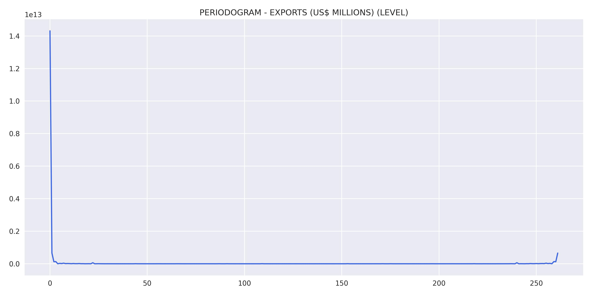
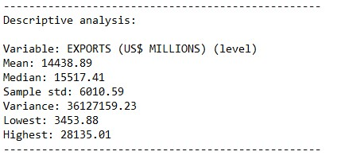
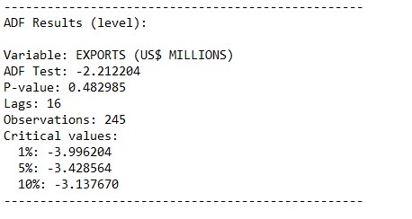
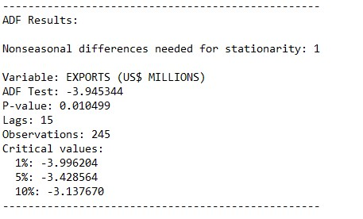
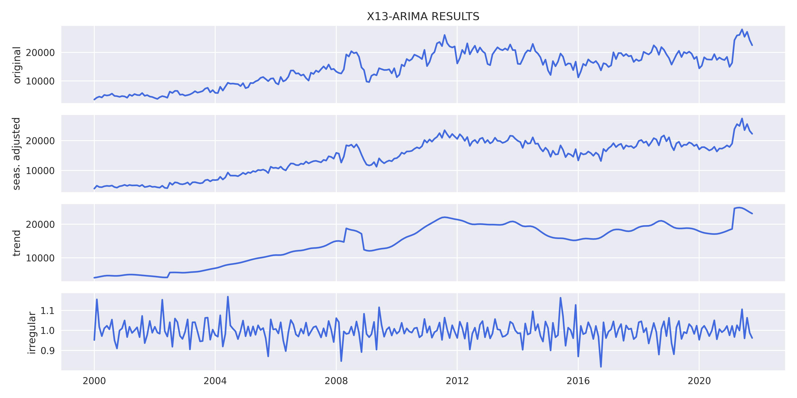
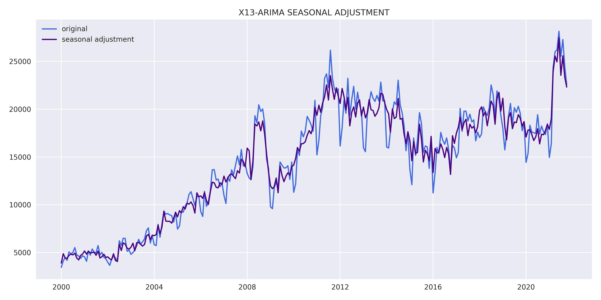
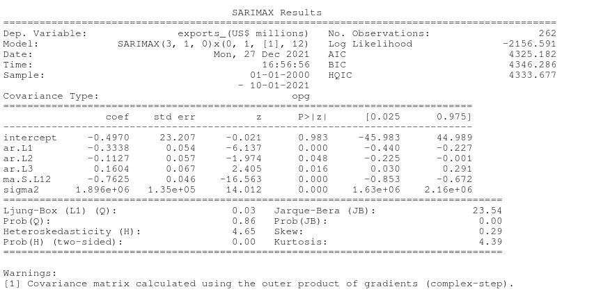
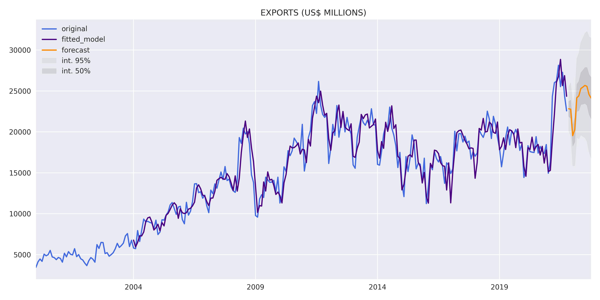

# **DESCRIPTION**
Exports (FOB)

Exports are the values of sales abroad and other remittances of goods owned by residents in the country, recorded in the Balance of Trade of the Balance of Payments. The FOB value indicates the price of the goods in US dollars under the Incoterm FOB (Free on Board), modality in which the exporter is responsible for shipping the goods while the importer pays for freight, insurance and other post-shipment costs. For this case, the export referring to the country's total volume was considered. More information: http://www.ipeadata.gov.br/doc/Manual_Versao_1_0.pdf

Source: https://www.gov.br/produtividade-e-comercio-exterior/pt-br

# **RESULTS**
Results obtained through the model estimation process.

## Variable analysis at level:
    

    

    

    

## Study of data stationarity:
    

    

## SEASONAL ADJUSTMENT:
    

    

## Model results:
    

## Residual analysis:
    

    

    

# FORECAST:
    
